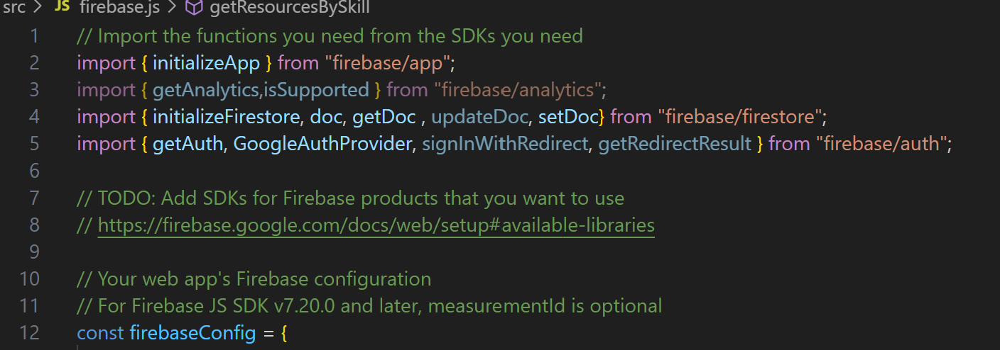
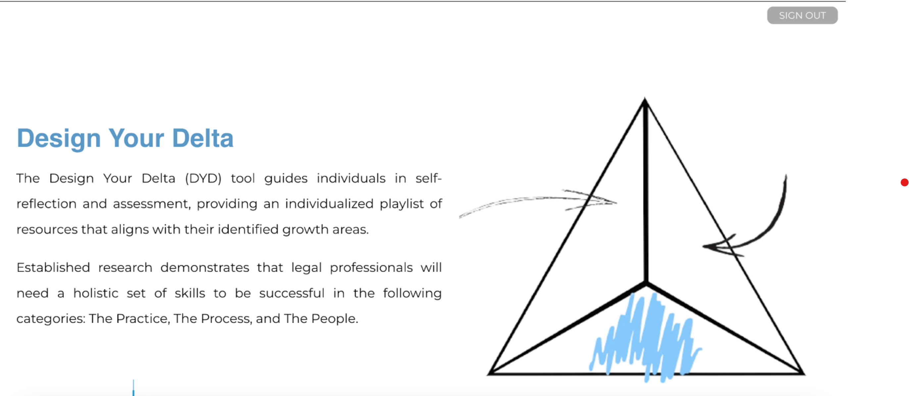
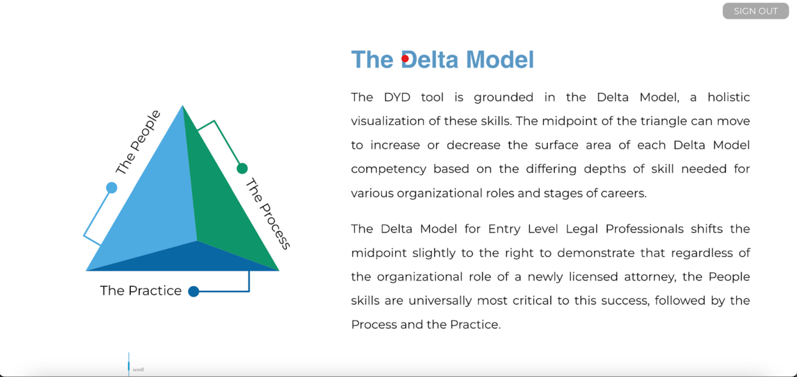
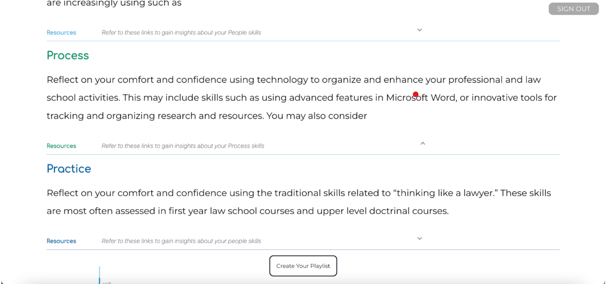
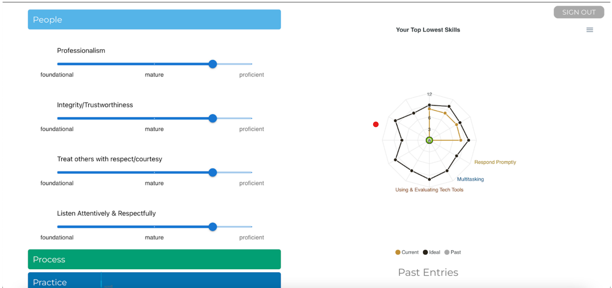
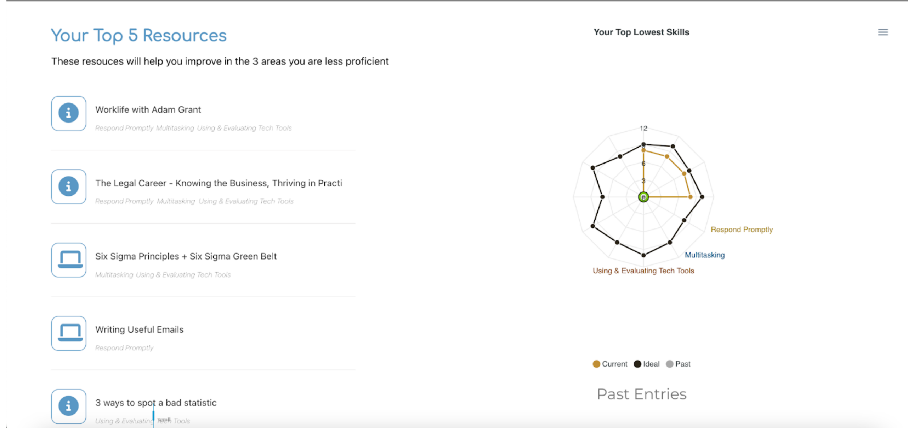

About The Project
-------------

The Design Your Delta app helps law students recognize that success in the law is based on a broad skill set beyond the traditional focus on “how to think like a lawyer” skills taught in the first year curriculum at all law schools. Students will interact with the app in the following ways:

Show picture of the Delta Model 
Ask students to rate their skill level in twelve different areas (four for each side of the model) using terms such as: foundational, mature, proficient
Present students with a growth chart: two spider graphs that compare their current skill level and the ideal skill level
Provide playlist of resources that will help them grow in the areas most lacking according to the skill chart

## Built With

- React
- Firebase
- Material UI
- Jest
- ApexCharts

## Getting Started

This guide provides step-by-step instructions for installing the delta-lab repository with Jest and Firebase.

### Prerequisites

Before proceeding with the installation, ensure that you have the following software installed on your system:

- Node.js (version >= 12.x)
- NPM (Node Package Manager)

### Installation Steps

1. Clone the repository to your local machine using the following command:
    ```bash
   git clone <repository-url>
   ```

2. Navigate to the repository's directory:
    ```bash
   cd <repository-directory>
   ```

3. Install the required dependencies using NPM:
    ```bash
   npm install
   ```

4. Once the installation is complete, you can run the project using the following command:
    ```bash
   npm start
   ```

   This command will start the development server and open the application in your default browser. You can view and test the React application locally.

5. To run the Jest tests included in the repository, use the following command:

   ```bash
    npm run test
    ```

   This will execute the test suite and display the results in the terminal.

## Firebase Setup:
Step 1: Create a Firebase Project
----
1. Go to the Firebase Console and log in with your Firebase account. 
2. Click on "Add project" or select an existing project.
3. Enter a project name and choose your desired options (e.g., enabling Google Analytics).
3. Click on "Create project" to create your Firebase project.


Step 2: Set Up Firebase SDK
----
1. Install the Firebase CLI globally by running the following command in your terminal: 

``` 
npm install -g firebase-tools
```

2. Authenticate the Firebase CLI by running the following command and following the authentication steps: 
``` 
 firebase login
 ```

3. Initialize Firebase in your project directory by running the following command: 
``` 
 firebase init
 ```
4. Select the Firebase features you want to set up (e.g., Firestore, Authentication) using the arrow keys and press Enter.
Follow the prompts to configure each feature, such as selecting an existing Firebase project or creating a new one.
After configuration, Firebase will create necessary files (e.g., .firebaserc, firebase.json) in your project directory.


Step 3: Replacing Firebase Config
----
1. In line 12 of firebase.js, replace the firebaseConfig JSON with your custom firebase config setup. This can be found by navigating to Project Settings -> Your Apps in your Firebase Console.



Step 4: Importing Resource & Skills data into your new Firestore Database
----

1. Go to the Firebase console and navigate to your Project Settings, then click on "Service Accounts".
2. Click on "Generate new private key" to download a JSON file to your computer.
3. Open the utilities folder in the deltalab repository.
4. Copy the content of the generated JSON file and paste it into the empty config.json file in the utilities folder.
5. Open the main.py file.
6. If you have completed the previous steps, running this script will populate your new Firestore database with the necessary data from the playlist CSV file.
- The CSV file contains all the recommended resources for the Design Your Delta project, with each resource tagged with the corresponding skills it targets.
- If you want to add new resources to the project, simply add them to the CSV file and run the main.py script again!

Usage
-----
To use our app, follow these steps to test what the user will experience:

1. Press the "Create Your Playlist" button to start the process.
You will see three tabs labeled People, Process, and Practice.

2. Click on each tab to access the corresponding category.

3. Within each tab, you will find four categories related to that specific aspect (e.g., collaboration, communication, emotions under the People tab).
4. Rate your proficiency in each category on a scale of 1 to 10, indicating your level of skill or comfort.

5. If you want to see all four categories within a tab, simply click on the tab's button to maximize it.

6. Once you have rated all the categories in each tab, click the "Analyze Your Skills" button.

7. You will be directed to another page that displays the top three resources relevant to improving the three categories in which you rated yourself lowest.

8. Explore the recommended resources and take advantage of the content provided to enhance your skills in those areas.

### Frontend Details
---

When you start the app the homepage is rendered showing a description of the Delta Your Delta Tool. The content on this screen is defined in the HomePage.jsx file.




Scrolling down, you will see a page with a description of the Delta Model and an interactive visualization of the model. The content on this page is also defined on HomePage.jsx and the visualization component is rendered by the DeltaPopUp.jsx component.





You will also find a Sign In / Sign Out Button at the top right corner of the screen which controls the signIn() and signOut() functions defined in the file AuthContext.js. We used Google Authentication to sign users into our Firebase account, as described in the following documentation: Authenticate Using Google with JavaScript. When you click sign-in, you will be redirected to a Google Sign in page. We use the React Context component to hold the user object returned upon sign in. We make the user object accessible from all pages by wrapping the entire app in a React Context.Provider component.


Scrolling further you will find a page instructing the user to reflect on their skills corresponding to the Delta Model and providing corresponding resources for reflection. 





Once you click the “Create Your Playlist” button a new page will appear featuring a set of sliders on the left and a spiderchart graph on the right. This page is defined in the FormBox component, which is inserted in the HomePage.jsx component when the “Create Your Playlist” button is clicked. The spiderchart graph is defined in RadarChart.jsx. The sliders control the “Current” series in the spiderchart. After you click  the “Analyze Your Skills” button your skill levels will be saved to the database according to the date the form is filled out.





Once you click the “Analyze Your Skills” button, a page will appear showing the top 5 resources targeting your top growth areas. 





If you have filled out the skills form before, the manu Past Entries will contain prior dates at which the form was filled out. Selecting one of these dates will render the “Past” series on the spiderchart. 


Roadmap
----
- [ ]  Improve Mobile responsiveness
- [ ]  Refactor Authentication for better security protocol (i.e. SSO for students)
- [ ]  Add Resources page with all the playlist links and additional documents from Alyson and Juliet
- [ ]  Add option to change model/ideal spidergraph data for people at different stages of their careers.

Contributing
----
- Fork the Project
- Create your Feature Branch (git checkout -b feature/AmazingFeature)
- Commit your Changes (git commit -m 'Add some AmazingFeature')
- Push to the Branch (git push origin feature/AmazingFeature)
- Open a Pull Request
- Resolve merge Issues and merge into main


Authors 
----
- Purple Team; Northwestern University Computer Science 394 - Intro to Agile Software Development 

- Mame Coumba Ka | mameka2024@u.northwestern.edu | coumbaK

- Callum Bondy | callumbondy2023@u.northwestern.edu |  cbondy100

- Isaac Kim | isaackim2024@u.northwestern.edu |  ikim-2001

- Max Lou | MaxLou2024@u.northwestern.edu | maxlou188

- Tanya Petriv | tatyanapetriv2023@u.northwestern.edu | tanyapetriv

- Lev Rosenberg | levrosenberg2024@u.northwestern.edu | lev-rosenberg


Acknowledgements
----

- Alyson Carrel , Clinical Professor of Law, Northwestern University Pritzker School of Law

- Juliet Sobel , Northwestern University Pritzker School of Law 23


